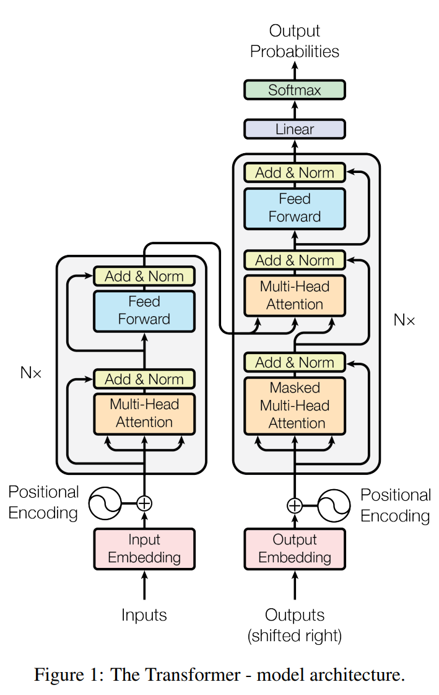
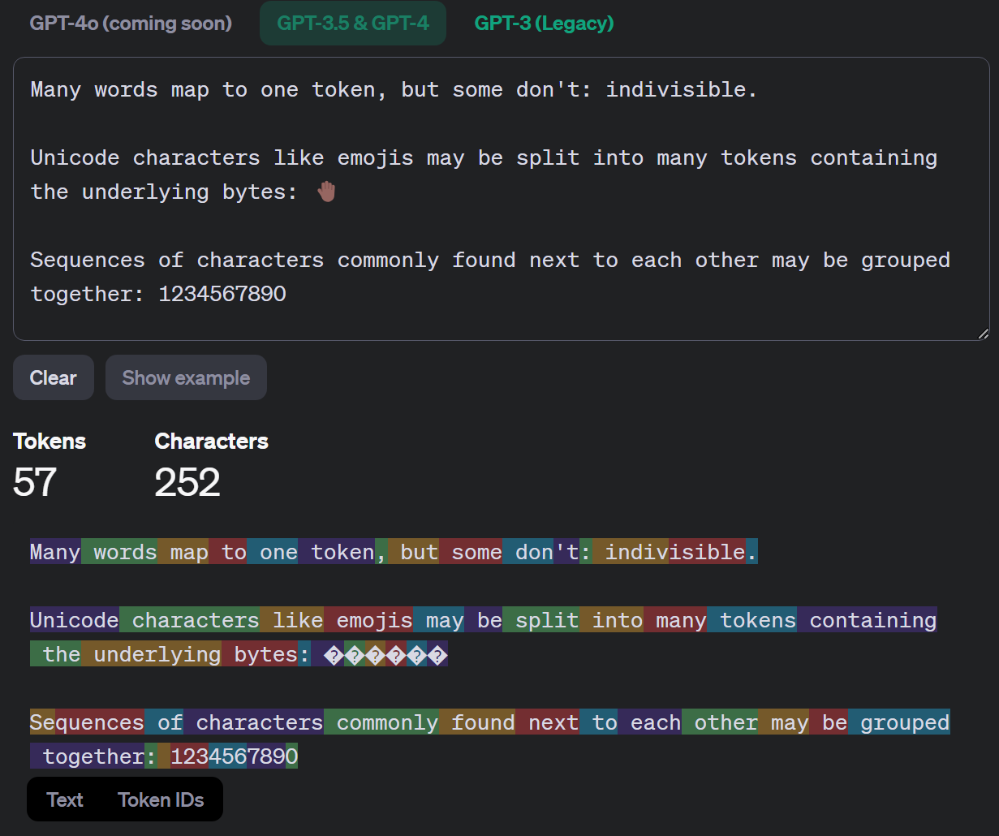

# 本地部署大语言模型的中文教学
Hello!

大家好，这里是Anser!这个是一个尽可能详细地关于大语言模型LLM的本地部署的教学。希望能帮到各位！

如果你希望能够本地运行LLM，不想花钱买API，想要在本地聊天和制作自己的工具，那么这篇文章就是适合你的！

我已经制作了自己用的两个应用。一个是一个多语言翻译器，另一个是一个总结长篇PDF或者网课视频的小工具。所以在这里分享一下我的经验！

我很有可能会犯点错，不过请谅解！还可以告诉我哪里错了怎么改，谢谢！

赞助我：[Buy me a coffee](https://buymeacoffee.com/ansertbyu)

非常感谢！

此外感谢LocalLLama Reddit，让我学到很多知识，有很多不吝分享的人们教会我很多东西。

感谢我的好兄弟白云酱（？）通过不懈的（？）实践（！？）、探索与讨论为这篇文章的写作提供重要的支持！

## 目录

- [本地部署大语言模型的中文教学](#本地部署大语言模型的中文教学)
  - [目录](#目录)
  - [了解大语言模型LLM](#了解大语言模型llm)
    - [什么是LLM？](#什么是llm)
    - [GPT架构](#gpt架构)
    - [Transformers](#transformers)
    - [Tokenizer](#tokenizer)
      - [BPE (Byte Pair Encoding) Tokenizer算法示例](#bpe-byte-pair-encoding-tokenizer算法示例)
        - [算法步骤](#算法步骤)
        - [示例](#示例)
        - [步骤1-2: 初始化](#步骤1-2-初始化)
        - [步骤3-5: 首次迭代](#步骤3-5-首次迭代)
        - [后续迭代](#后续迭代)
        - [最终结果](#最终结果)
      - [实际应用](#实际应用)
    - [Word Embedding](#word-embedding)
    - [注意力机制与上下文长度](#注意力机制与上下文长度)
  - [电脑硬件、操作系统、GPU加速的基础知识](#电脑硬件操作系统gpu加速的基础知识)
    - [CPU和RAM](#cpu和ram)
    - [GPU与VRAM](#gpu与vram)
      - [GPU性能](#gpu性能)
      - [VRAM(显存)](#vram显存)
      - [多显卡运算](#多显卡运算)
      - [显存带宽](#显存带宽)
      - [GPU优化](#gpu优化)
    - [推理时候的过程](#推理时候的过程)
    - [内存与显存占用](#内存与显存占用)
    - [FP16与Quantization](#fp16与quantization)
      - [半精度(FP16):](#半精度fp16)
      - [量化(Quantization):](#量化quantization)
    - [Finetune](#finetune)
    - [上下文Context](#上下文context)
      - [Recall accuracy](#recall-accuracy)
  - [如何为LLM配置一台电脑](#如何为llm配置一台电脑)
    - [便携性](#便携性)
    - [未来······](#未来)
  - [选择你要用的模型](#选择你要用的模型)
    - [Hugging face demos](#hugging-face-demos)
    - [技术报告](#技术报告)
    - [Benchmark和ranking](#benchmark和ranking)
      - [LMSYS Chatbot Arena](#lmsys-chatbot-arena)
    - [常用模型推荐](#常用模型推荐)
  - [对话与提示](#对话与提示)
    - [系统提示](#系统提示)
    - [系统提示的制作方法](#系统提示的制作方法)
    - [对话格式](#对话格式)
  - [部署方法](#部署方法)
    - [llama.cpp系列](#llamacpp系列)
      - [lmstudio](#lmstudio)
      - [Ollama](#ollama)
      - [llamacpp-python](#llamacpp-python)
    - [ONNX, Intel OpenVino](#onnx-intel-openvino)
    - [Python 相关](#python-相关)
      - [Conda与Docker](#conda与docker)
      - [Hugging Face Transformers](#hugging-face-transformers)
      - [Pytorch与Tensorflow](#pytorch与tensorflow)

## 了解大语言模型LLM
我建议你在开始部署和使用LLM之前先对它们这一类的模型有一个具体的了解。

如果你已经有了解了，只是想知道如何操作，我推荐你跳过这部分。

其实我讲的还是太浅了，这里我推荐真大佬Andrej Karpathy的YouTube视频：[Intro to Large Language Models](https://www.youtube.com/watch?v=zjkBMFhNj_g)

讲的超好，强烈推荐，无需编程经验和数学基础也能听懂。强烈推荐！

### 什么是LLM？

大语言模型（Large Language Model，简称LLM）是一种基于深度学习的自然语言处理模型，能够理解、生成和操作人类语言。

### GPT架构

GPT（Generative Pre-trained Transformer）是目前最流行的LLM架构之一，也是目前所有主流语言大模型的架构。

GPT模型采用了Transformer架构的解码器部分，通过自回归方式预测输入文本下一个词，准确来说是Token。

GPT的训练通常包含预训练和微调。首先在大规模语料上进行无监督预训练，然后在特定任务上进行微调。

这里在预训练时模型会被喂大量的原文本，例如维基百科这类的。它会尝试预测下一个Token(一种文本分割后的词块，你可以这么理解，待会讲)来学习文本中的知识。但是原始模型是不会使用对话的格式和你说话的，唯一会做的就是补全文本。

但是在GPT2被制作出来之后OpenAI的研究人员发现这种预训练模型有很强的多任务能力并且还表现出一定的只能，所以他们陆续制作了GPT3，Instruct-GPT（第一个对话模型）GPT-3.5，GPT4与GPT-4o。

Boom！LLM大爆炸~

在完成pre-train后会对模型在人类的对话上进行微调，让后你才能和它进行聊天。微调相当于使用各种方法在对话格式的数据上训练，这样它才会具有遵守人类指令做事情的人类。

### Transformers

Transformers是一种基于自注意力机制的神经网络架构，最初由Google在2017年提出。

神之论文：[Attention Is All You Need.](https://arxiv.org/abs/1706.03762)

说实在很难想象一个深度学习架构在提出后的这么长的时间里都没有什么大的改动，可见这篇论文有多牛。

不多说了，上图。



这里左侧的被称为编码器Encoder，右侧的被称为解码器Decoder.因为这篇论文本身是给机器翻译这个任务做的，所以架构是Encoder-Decoder架构，而GPT是Decoder Only的，也就是没有左侧的这块，并且右侧的中间的Multi-Head Attention和Add & Norm也没有。

一个Transformers通常会堆叠多个Decoder block。参数越多一般就越深，层数也越多。

它的主要组件包括：

1. 多头自注意力层
2. 前馈神经网络
3. 层归一化
4. 残差连接

Transformer通过并行处理输入序列，大大提高了模型的训练效率和性能。

其实你不需要知道模型内具体发生了什么就可以用，但是如果你想要从零开始了解的话我推荐你去看3Blue1Brown的Transformer讲解视频，YouTube和Bilibili上都有，原视频：

[But what is a GPT? Visual intro to transformers | Chapter 5, Deep Learning](https://www.youtube.com/watch?v=wjZofJX0v4M)

这也讲的很好，适合新手起步学习。

### Tokenizer

我想先指出LLM不通过每个字符来阅读文本，例如当我输入Lowest这个单词的时候它不会看见6个字母，而是一个或两个Token。理解Token对理解LLM至关重要，所有这里有个例子借着讲一讲。

Tokenizer是将原始文本转换为模型可以理解的数字序列的工具。

常见的tokenization方法包括：

1. 字符级：将文本分割成单词。（这个输入长度会爆炸，而且不方便模型获取文本中的信息）
2. 子词级：将单词进一步分割成更小的单位，如BPE（Byte Pair Encoding）。
3. 单词级：将文本分割成单个字符。（中日韩和表情包就没法搞了）

LLM通常使用子词级tokenizer，以平衡词汇表大小和表达能力。

什么意思捏？举个例子：

#### BPE (Byte Pair Encoding) Tokenizer算法示例

BPE是一种广泛使用的子词tokenization算法。它通过迭代地合并最频繁出现的字符对来创建新的子词。以下是BPE算法的简化步骤和示例:

##### 算法步骤

1. 准备词汇表和训练语料
2. 将每个单词拆分为字符序列,并在末尾添加结束符(如"</w>")
3. 统计所有字符对的频率
4. 选择最高频率的字符对合并为新的子词
5. 更新词汇表和语料中的词
6. 重复步骤3-5,直到达到预设的词汇量或迭代次数

##### 示例

假设我们有以下简单的训练语料:

```
low lower newest widest
```

##### 步骤1-2: 初始化

将单词拆分为字符,添加结束符:

```
l o w </w>
l o w e r </w>
n e w e s t </w>
w i d e s t </w>
```

初始词汇表:
```
l, o, w, e, r, n, s, t, i, d, </w>
```

##### 步骤3-5: 首次迭代

1. 统计字符对频率:
   ```
   (e, s): 2
   (s, t): 2
   (e, r): 1
   (l, o): 2
   (o, w): 2
   ...
   ```

2. 最高频率的对是(e, s), (s, t), (l, o), 和(o, w)。我们选择(e, s)。

3. 合并(e, s)为新的子词"es":
   ```
   l o w </w>
   l o w e r </w>
   n e w es t </w>
   w i d es t </w>
   ```

4. 更新词汇表:
   ```
   l, o, w, e, r, n, s, t, i, d, </w>, es
   ```

##### 后续迭代

继续这个过程,可能的合并顺序:
1. (l, o) -> "lo"
2. (o, w) -> "ow"
3. (es, t) -> "est"
4. ...

##### 最终结果

经过多次迭代后,我们可能得到这样的词汇表:
```
l, o, w, e, r, n, s, t, i, d, </w>, es, lo, ow, est, low, newest, widest
```

这个词汇表现在包含了原始字符、常见的子词和完整的单词。所以当low再次出现时我们就不会把他们仨看作三个单词，而是一个新的Token，所以lowest这个单词实际上就变成了[low]和[est]两个token。同样的方法也适用于中文日文韩文和表情包之类的。

#### 实际应用

简单来说，这种Tokenizer就是一种基于字符组合出现频率的分词方法，Tokenizer不是一个神经网络，并且通常在模型训练前就会练好。

在实际的大规模语料中,BPE算法会产生更大、更复杂的词汇表。例如,GPT-2使用的词汇表大小为50,257。这种方法允许模型高效地处理常见词、罕见词和未知词,因为它可以将任何单词分解为已知的子词序列。

BPE和其他子词tokenization方法(如WordPiece, SentencePiece)的使用大大提高了LLM处理各种语言和领域文本的能力。

如果你想体验一下Tokenizer怎么工作可以去这个试用GPT4 Tokenizer的网站。[OpenAI GPT4 Tokenizer](https://platform.openai.com/tokenizer)



此外出现的问号是因为有的时候Tokenizer会把UTF-8编码的字符（例如中文字符和表情）给分成好几个Token所以就没法看出单个Token对应的时哪个字符。

### Word Embedding

词嵌入是将词语映射到低维稠密向量空间的技术。在这个空间中，语义相近的词会有相似的向量表示。

在现代LLM中，词嵌入通常是在模型训练过程中学习的，而不是预先定义的。

是的，所以你可以理解为Word Embedding帮助模型把Token投射到一个向量组成的高维空间里，而每个向量都代表了词的意思。

### 注意力机制与上下文长度

注意力机制是Transformer和LLM的核心组件之一。它允许模型在处理输入序列时，动态地关注不同部分的信息。主要类型包括：

1. 自注意力：计算序列内部元素之间的关联。
2. 交叉注意力：计算两个不同序列之间的关联（在encoder-decoder结构中使用）。

注意力机制通过计算查询（Query）、键（Key）和值（Value）之间的相似度来实现，使模型能够捕捉长距离依赖关系。

所以当我输入一段话时，模型会借此结构来观察上下文的意思。

TODO: ADD more detail.

## 电脑硬件、操作系统、GPU加速的基础知识
电脑硬件相关的知识真的很重要！

很多时候我会被问：我的电脑能跑这个吗？请不要轻易的觉得能跑或者不能跑，LLM飞速发展了两年已经有了很多的可用的部署方法，请往下接着读，看看哪一种方法和模型适合你的电脑

一台电脑，包括笔记本和台式机，常见的组件包括CPU,RAM(内存),硬盘（存储）。GPU和主板电源等。这里和我们任务相关的就只有CPU,RAM,GPU和GPU自带的VRAM。

### CPU和RAM
CPU是电脑的中央处理器。现代CPU真的很快，所以我们可以使用CPU进行大语言模型的推理。

现代CPU在推理一些7B模型也能很快。例如我的小笔记本电脑有着AMD Ryzen R5 7640U（一个28W的笔记本处理器，其实很弱）但是在推理llama3 7B的时候却可以到8Tokens每秒。（Token是什么下面会讲）

RAM也叫内存，不同于硬盘是临时储存数据的地方。

对于使用CPU进行推理，以下是一些关键硬件知识：

1. **CPU性能，CPU核心数与CPU频率**：
    对于使用CPU的大语言模型，我们希望CPU的多核性能尽可能地强。

    CPU核心数决定了同时执行的线程数量。更多的核心数可以提高并行处理能力，从而加快推理速度。你可以在Windows的任务管理器里看到自己的核心数量。

    CPU频率表示每秒钟执行的指令数。较高的频率意味着更快的计算速度。

    此外，你还可以使用其他的跑分软件生成的分数来衡量CPU的性能。相关的分数可以在互联网上搜索，比较常见的有GeekBench，Cinebench等。

    关于CPU的选择：大体来说无所谓，上网找benchmark，看看多核性能谁强然后找个买得起的买就好了。小处确实有差别，但是我觉得不重要，无所谓。
    
2. **RAM容量**：
    RAM是计算机用于存储数据和程序的临时存储器。当使用CPU进行运算时，运算的部分必须存在RAM中。所以RAM大小很大程度决定了LLM能不能跑。我强烈建议你有至少16GB的内存。

    较大的RAM容量可以提供更多的内存空间，从而减少数据交换和读取的次数，提高推理效率。

    RAM的大小最好要大于模型的大小+操作系统占用的大小。因为CPU只能直接运算存储在RAM中的数据，所以内存如果小于模型的话你就装不下了。

    常见的模型大小就下面这几个挡位，推荐的模型大小对应的内存大小（不过你要小于推荐值下面也有办法，就是使用Quantization压缩模型到更低的精度，不过这样会降低性能就是了，这个后面也会讲）：
    - 6~8B模型：16GB
    - 12~15B模型：16GB
    - 30~35B模型：32GB
    - 60~75B模型：48GB
    - 100~130B模型：64GB


3. **内存带宽**：
    内存带宽决定了数据在RAM和CPU之间传输的速度。较高的内存带宽可以加快数据的读取和写入速度，提高推理性能。
    
    内存带宽对LLM来说速度影响挺大，所以苹果电脑在推理上会很快，因为它的共享内存带宽很高。GPU更快的一个原因也是使用了比普通内存更快的GDDR6内存。

    我的内存使用的是双通道DDR5 5600。你如果会玩超频的话可以超一超内存的频率。支持双通道内存的CPU最好上两根内存条，这样会更快。

    一部分高级笔记本或者工作站会使用频率更高的内存，例如DDR5 7500这种的，理论上这个会对CPU推理有提升，但是我也没有，不知道，另外如果你都用上这种高级货了，我建议还是用GPU推理。

当选择使用CPU进行大语言模型推理时，建议考虑以上硬件因素，并选择具有较高核心数、频率的CPU和足够的内存RAM容量，以获得更好的性能和推理速度。

### GPU与VRAM
GPU(图形处理器)最初是为图形渲染和游戏设计的,但由于其并行计算能力强大,现在也被广泛用于加速AI模型的推理和训练。

#### GPU性能

高端GPU具有数以千计的核心,每个核心可同时执行多个线程,能够高效地并行处理大量的矩阵和向量运算,正是AI模型所需。常见的GPU型号有Nvidia GeForce RTX和AMD Radeon RX系列。目前intel也加入了制作GPU的行业。

此外苹果M系列处理器的集成显卡也很强，能够很好的完成同样的任务。

对于Nvidia卡，越新的代速度越快，架构升级的提升还是挺明显的。尤其是RTX 40系，速度提升蛮大的。在40系的RTX卡中会有对半精度FP16的优化，所以速度提升会比较大。打游戏主要FP32精度是很重要，所以30及之前的GPU没有对半精度特别优化。

#### VRAM(显存)
VRAM是GPU自带的内存,用于存储GPU需要处理的数据和程序指令。与CPU访问主板内存相比,GPU访问VRAM的速度更快。和CPU一样，GPU需要把数据挪到VRAM内才能进行运算。请记住在内存和显存间移动数据也需要花时间。

大型语言模型通常需要大量VRAM，Vram的占用量和上面的RAM的量类似。

一块RTX 3090/RTX 4090/Radeon 7900XTX显卡的显存大小是24GB，你可以用它很快的跑一个Q4精度下32B的模型，估计（我哪来这些卡）在15/20/15Token每秒左右。

一块4060Ti 16GB版有16GB的显存，你可以拿他跑Q4 14B或Q2 32B的模型。Q2精度更低，效果更差但是模型会变小。

大显存是很重要的！

**！！！但是！！！** 你可能会说你的显存太小了装不下，不过这也能跑:

我们可以把LLM分成多个部分拆开分开运算。是的这让它变慢，但是！你可以做的一件事是把LLM的一部分塞进VRAM由GPU运算然后把剩下的部分存在RAM里。

所以我也可以拿24GB的4090跑Q3 70B参数的模型（34GB大小左右），尽管24GB还是装不下，但是我内存RAM装得下就行，然后只需要把正在运算的部分挪入VRAM就可以。不过来回挪也要花时间，所以建议你的显存之和不要小于模型的一半，越大越快，越小越慢。

#### 多显卡运算
同样的，正如你可以把模型切到内存和显存里，你也可以使用多张显卡，然后把模型切到很多个显卡里。这样你可以用4*4060ti 16GB来组合成64GB显存，然后你就可以只用1600美元左右的显卡来跑一个110B的大大模型。

不过切分模型确实会降低速度是了，不过单个最便宜的48GBNvida卡我找到的是一个Quadro RTX 8000也要2400美元左右还是二手的。

对于多GPU配置你可以考虑组合多张卡，例如我在已经有4090的情况下未来可能会考虑加两张16GB的RTX5060（如果未来有的话）来组成一个便宜的56GB内存。这样我可以运行Q3的110B模型或者Q5的72B模型。

此外还有一些阴间操作，我不推荐，但是你觉得你行那也可以试试。

Nvidia有很多老服务器卡会有很大的内存但是很便宜。你可以去搜索Nvidia P40或者K80（这辆都是24GB显存的老卡）。然后你就能看见一堆150美元一张的没风扇的二手服务器卡，你需要使用电源转接头和3D打印来改装一个风扇上去，还有调主板设置之类的。

我说着都嫌麻烦。不过你愿意折腾可以试试。主要是这个价格真的很便宜，而且我保证再老的显卡也比CPU快。

另外当GPU多于三个的时候你需要考虑更多更复杂的东西，例如你的电源PSU，你的PCIE Lane数量，你的机箱大小。你可以考虑使用AMD ThreadRipper或者Intel Xeon CPU（很贵）与其配套的主板来解决之类的问题。像我如果要使用三卡配置的话，那么我的计划是买一个有三个PCIE接口的主板然后直接把三张卡用延展线塞到我的ATX机箱里。

#### 显存带宽
指VRAM与GPU之间数据传输的速率,也决定了GPU的整体性能。较新的GPU使用更快的显存(如GDDR6X)以提高带宽。

#### GPU优化
制造商通过优化的软件库(如Nvidia的TensorRT)和硬件设计(如Tensor Core),进一步提升GPU在AI推理的性能。

Nvidia的GPU优化是做的最好的。当你使用的是最新的的RTX 30/40系时（这也包含其他Ada Lovelace / Ampere架构的卡，例如RTX A5000）你可以使用一部分新的功能进一步提升你的速度，所以我的建议是买新不买旧。

### 推理时候的过程

纯CPU或GPU推理：

CPU -> RAM

或者

GPU -> VRAM

所以这里带宽很重要。

使用部分载入VRAM推理：

RAM -> VRAM;

GPU -> VRAM

这个来回挪模型就会慢很多。

### 内存与显存占用

我在上面有给过一个内存模型大小的对照表，但是实际情况复杂不少，这里展开讲讲。

以1B参数的模型为例子。一个字节是1 Byte，1GB = 10 ^ 9 Byte。
- 参数精度:一般来说,参数使用32位浮点数(FP32)存储。每个FP32参数占用4个字节。
- 参数个数:1B参数=1,000,000,000个参数。
- 附加内存开销:除了存储参数本身,运行模型还需要额外的内存用于中间计算、缓存等。在推理中没有Optimizer这个东西所以这个不用太担心，比较小。
- 如果你跑的是长context（下面会讲），模型也会变大。更短的context length会少量的减少内存占用。

假设使用FP32精度,1B参数模型在32位系统上的总内存占用计算如下:
参数本身: 1,000,000,000 * 4 Byte = 4,000,000,000 Byte = 4 GB
附加内存: 差不多0.3GB
总内存占用: 4 GB

但是如果这样的话4090连7B都跑不了啦~ 

(-_-)!

所以有了各种各样的降低精度来减小内存的方法。


### FP16与Quantization

#### 半精度(FP16):

- FP16，和FP32类似，是一种浮点数据类型,使用16位来存储数值,而常规精度(FP32)使用32位。
- 使用FP16可以将模型的内存需求减少一半,从而允许在相同的GPU内存下加载更大的模型。
- 一些GPU有专门的Tensor Core来加速FP16计算,可以大幅提高推理和微调的速度。
- 但是FP16精度较低,对某些任务可能会导致数值不稳定或精度损失。

#### 量化(Quantization):

- 量化是将原始的FP32权重映射到较低比特宽度的定点数表示,例如INT8。
- 这可以进一步减少模型大小和内存需求,但代价是精度损失。
- 常见的量化有Q8,Q5,Q4,Q3,Q2，下面是一张模型性能和占用内存大小随着量化的变化图。

来自[Github](https://github.com/ggerganov/llama.cpp/pull/1684)

K Quantization vs Perplexity


左边的Perplexity可以理解为模型表现（其实不完全是），下面的model size是内存大小。

我们可以看出，相比FP16，Q5678的性能损失都很小，然后Q2和Q1就直接蠢晕。

**所以我推荐你使用Q5或者Q4，实在不行用Q2，别用Q1**

另外，越大的模型65B，对抗低精度带来的性能损失就越强。所以就算是30B的Q2也强于14B的Q5。具体的根据使用的要求取舍就好。

量化模型大小表（我自己估的）单位：GB

| -   | 7B  | 14B | 32B | 65B | 110B|
|-----|-----|-----|-----|-----|-----|
|  Q2 |  3  | 6.0 | 14.0| 28.0|31.0 |
|  Q3 |  4  | 7.0 | 16.0| 33.1|45.0 |
|  Q4 |  5  | 8.0 | 20.5| 40.0|58.0 |
|  Q5 |  6  | 9.5 | 25.1| 48.0|70.0 |

（笑死，我还写了小数假装自己很专业）

### Finetune
对于上面的所有内存要求都有一个关键的前提，那就是模型实在推理状态下运行的。

什么是推理状态呢？它相对的就是训练状态。当推理时，电脑内存中只需要存储模型参数就可以了，但是训练时还需要模型参数的导数Gradient。

举个例子，对于一个神经网络，输入为一个长度为2的向量x1,x2，有两个参数w1,w2。神经网络的输出为y = x1\*w1+x2\*w2,当推理是只需要存储这四个数就行，但是如果训练中就需要计算x1与x2对loss的偏导。

所以你能推理一个模型不代表你可以训练一个模型。当然了，训练模型也有训练时减小内存占用的方法，例如Lora，不过这个不是我这篇文章的重点。如果有兴趣的话我回头可以讲讲。

### 上下文Context

每一个LLM都有固定的最大上下文长度，这个通常可以在公司们的技术报告里找到。这个长度在训练时就确定了，一个模型只能接收小于短于该长度的输入。这个长度以Token（一种通过聚合多个UTF8编码形成的压缩后文本，下面会讲）来计算。


#### Recall accuracy
对于Context以内的内容，LLM也不一定能够很好的定位信息。当输入较长例如8K的长文本是有的时候LLM会遗忘很长之前的信息。

对于测试LLM寻找长文本中信息能力的一种方法就是计算Recall Accuracy。

例如在来自Claude报告的下图中我们可以看到Claude对于定位80K Token之前的内容就会容易丢信息。所以如果你需要自己的LLM保持高准确率的话我不建议太长的输入。


## 如何为LLM配置一台电脑

在回答这个问题前，你需要明确：

- 我的预算是什么？
- 我的需求是什么？

对于你的需求，指的是你要跑什么表现的模型，并且需要达到多快。请记住，***VRAM是很重要的***。

如果你要跑一个20GB大小的34B参数的模型那么24GB的RTX 3090会比16GB的RTX 4080快得多，因为3090能装下模型更多的部分，尽管它俩在价格上是类似的。

便宜的大Vram GPU有RTX 4060ti 16GB和RTX 3060 12GB，你可以通过组合多块这些卡来获得比较便宜的大 VRAM。

如果你够有钱的话直接四块4090+ThreadRipper Pro CPU。或者来一块A100 80G之类的。另外RTX 6000 Ada也是有48GB显存的好选择。

### 便携性
如果你需要便携性，例如想要一个笔记本之类的：

对于普通的1000美元左右的预算，我推荐你购买具有16GB VRAM的Nvidia GPU游戏本，30系显卡的也行。

如果你很有钱，我推荐你购买3500USD或者25000RMB价格左右的96GB内存的MacBook Pro。（RICH！）

苹果的M系列芯片由于其独特的内存和架构设计可以很快的推理LLM。如果你有96GB的内存的话你完全可以从中分出72GB的VRAM来运算LLM。这样你就可以轻松跑70B和110B的模型。

### 未来······
我现在是2024年5月，未来可能会出RTX 50系列，另外笔记本中也会集成NPU，不过因此可能带来的变化要到时候再说了，这些都是值得关注的事情。

我强烈建议你在现在要买GPU的话再等等，到时候这一些新卡出来了老卡也会便宜很多。

等5090出了我就可以再买一块3090了，好耶ヽ(✿ﾟ▽ﾟ)ノ

## 选择你要用的模型

模型怎么选？虽然模型每个都不一样并且有自己的优缺点，但是还是有很多方法能够帮助各位选择最适合自己使用例的模型。

请在选择模型的时候一定要考虑到下面几个点：

- 每个模型都有训练和优化的任务方向，例如现在（2024/06）最棒的三个开源大模型（不包括200B+的Nemotron和Grok之类的）分别为Command R+， Qwen2 72B，和LLaMa 3 70B。这三个中LLama3是几乎没有多语言能力的，但是你如果用英语跟它聊天的话它真的超有趣的！CR+则被针对RAG和Function Calling专门优化过，他的多语言能力也不错，但是他的数学能力和写代码能力比较弱。Qwen2 72B是最新的模型，此外他的中文也最好。

- 结果是，每个模型都有自己在微调时被优化的方向。这点区别还是能有很大的。我建议各位为了自己的需求选择一个合适的模型。

- 此外，你也不一定非要使用最好的模型，很多时候够用就行。例如我的小小笔记本只有AMD Ryzen 5 7640U CPU和32GB 内存，我如果选择7B的Qwen2 7B或LLama3 7B的话速度就能到达很不错的9token/s，现在的小模型已经做的很不错了，说起话来人模人样的，所以我也不需要去装个又大又慢的大模型。用什么模型取决于你的任务。

- 而且很多时候你压根没有合适的硬件来运行这些大模型，看看你手头有什么显卡，有多少钱，再综合考虑最适合的模型。

选择模型有下面几个可以考虑的方向：

### Hugging face demos

很多时候开源模型都会在huggingface上放一个可以免费使用的webchat，你在网上搜应该就搜索得到。你可以通过试用这些来看看模型的效果。很多时候还挺有用的。

例如下面两个：[Qwen2-72B](https://huggingface.co/spaces/Qwen/Qwen2-72B-Instruct)
[Command-R+](https://huggingface.co/spaces/CohereForAI/c4ai-command-r-plus)

### 技术报告

几乎每个模型发布的时候都会发布一篇自己的技术报告，讲讲模型哪里好，多少钱，在测试上的表现有多少分还有和现有的模型比起来怎么样。

例如这个：[你好，Qwen2](https://qwenlm.github.io/zh/blog/qwen2/)

这个报告指出了模型的上下文长度，支持的语言，和评测表现之类的。

还有别忘了*模型的许可证*！！！！

如果你要商用的话别忘了好好看看许可证，像CC-BY-NC就禁止你使用模型去赚钱之类的，如果你自己玩或研究都无所谓，但你要不跟Cohere AI去写Command R+的使用申请还拿去例如做你的网上小应用赚钱就容易吃律师函。

如果一个模型使用的时Apache 2.0或MIT你就应该可以拿去商用，不过请务必看仔细！

### Benchmark和ranking

很多benchmark都能够提供重要的关于模型表现的信息，例如下面经典的MMLU，他的全名是Multi-task Language Understanding，测试的是模型对各种语言任务的理解能力。还有很多别的benchmark评测不同的方向，例如代码能力和数学能力之类的。

[MMLU](https://paperswithcode.com/sota/multi-task-language-understanding-on-mmlu)

benchmark也有很多问题，例如使用公开数据集的话就可以作弊，可以主动的或者不小心的让数据集的知识进入你的训练数据使得你的模型的纸面表现更好。

此外还有一些比较高级的方法例如对模型的输出形式进行优化，例如当我问“什么是从零开始的第10个质数？”它如果直接回答很有可能答不上来，但你要问很多模型的话你会发现他们会这么说

“让我们一步步来解决这个问题:

首先,让我们列出前几个质数:
2, 3, 5, 7, 11, 13, 17, 19, 23, 29, ...
我们可以从这个列表中数出第10个质数:
第1个: 2
第2个: 3
第3个: 5
第4个: 7
第5个: 11
第6个: 13
第7个: 17
第8个: 19
第9个: 23
第10个: 29

因此,从零开始的第10个质数是29。
”

事实上，他们被这么调成这个会一步步想这个问题的样子，这样回答一些需要思考的问题准确率会高很多。

所以我想说的是MMLU分数更高也不一定代表模型绝对更聪明。具体你还得用了才知道。

其实现在MMLU自从GPT4被发布之后就已经很难进步了，现在御三家GPT4-o, Claude 3.5 sonnet, Gemini 1.5 Pro都能够干到90分。

#### LMSYS Chatbot Arena
这个真的是超级有用的网站，你玩了就知道了。

[Chatbot Arena](https://chat.lmsys.org/?leaderboard)

这个相当于是一个竞技场类型的chat网站，用户对两个模型的输出进行盲测，然后选择自己认为输出的更好的那个，你可以看看它提供的leaderboard榜单，很能表现模型在各个方面的实力表现。这个榜单提供了在各种语言，和代码，长文本等任务上的表现排行，对我选择模型还是很有帮助的。

### 常用模型推荐

其实模型一直都在进步，然后常用模型也一直在变。我现在在2024/06列一个推荐表，不过可能过不了俩月就得变了。

|参数量|模型名称|
|-----|-----|
|  3B |  phi3-mini  |
|  7B |  LLaMa3-7B  |
|  7B |  Qwen2-7B  |
|  9B |  ChatGLM4-9B  |
| 32B |  Yi1.5-32B |
|70B|LLaMa3-70B|
|72B|Qwen2-72B|
|104B|Command-R+|

## 对话与提示

其实写提示还是挺讲究的，好的提示和坏的提示用起来完全不是一个感觉。

但是，该断章了，回头在写~

### 系统提示
### 系统提示的制作方法
### 对话格式

## 部署方法
### llama.cpp系列
#### lmstudio
#### Ollama
#### llamacpp-python

### ONNX, Intel OpenVino

### Python 相关
#### Conda与Docker
#### Hugging Face Transformers
#### Pytorch与Tensorflow